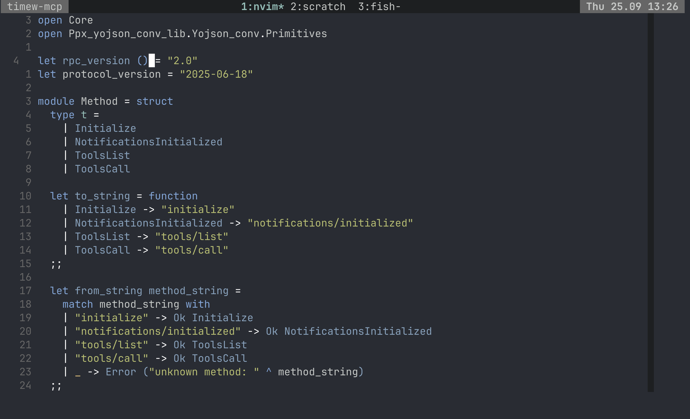

# 🖌️ ghostty-default-style-dark.nvim

> [!IMPORTANT]
> This work is totally based of gbprod/nord.nvim theme and I want no credit for it, leave the love
> for her/him!

> [!WARNING]
> This is personal software I will be happy to merge pull requests, but keep in mind that I do this
> on my own time and there are no guarantees.

Neovim theme using the ghostty-default-style-dark palette.



## ✨ Features

- supports TreeSitter and LSP
- vim terminal colors
- **lualine** theme

### Plugin Support

- [TreeSitter](https://github.com/nvim-treesitter/nvim-treesitter)
- [LSP Diagnostics](https://neovim.io/doc/user/lsp.html)
- [LSP Trouble](https://github.com/folke/lsp-trouble.nvim)
- [Git Graph](https://github.com/isakbm/gitgraph.nvim)
- [Git Signs](https://github.com/lewis6991/gitsigns.nvim)
- [Git Gutter](https://github.com/airblade/vim-gitgutter)
- [Telescope](https://github.com/nvim-telescope/telescope.nvim)
- [NvimTree](https://github.com/kyazdani42/nvim-tree.lua)
- [NeoTree](https://github.com/nvim-neo-tree/neo-tree.nvim)
- [WhichKey](https://github.com/liuchengxu/vim-which-key)
- [Lualine](https://github.com/hoob3rt/lualine.nvim)
- [Leap](https://github.com/ggandor/leap.nvim)
- [Barbar](https://github.com/romgrk/barbar.nvim)
- [Bufferline](https://github.com/akinsho/bufferline.nvim)
- [Cmp](https://github.com/hrsh7th/nvim-cmp/)
- [Navic](https://github.com/SmiteshP/nvim-navic)
- [Aerial](https://github.com/stevearc/aerial.nvim)
- [Notify](https://github.com/rcarriga/nvim-notify)
- [RainbowDelimiter](https://github.com/HiPhish/rainbow-delimiters.nvim)
- [Neogit](https://github.com/NeogitOrg/neogit)
- [highlight-undo.nvim](https://github.com/tzachar/highlight-undo.nvim)
- [Illuminate](https://github.com/RRethy/vim-illuminate)
- [Codeium](https://github.com/Exafunction/codeium.vim)
- [Flash.nvim](https://github.com/folke/flash.nvim)
- [Glance](https://github.com/dnlhc/glance.nvim)
- [Markview](https://github.com/OXY2DEV/markview.nvim)
- [Toggleterm](https://github.com/akinsho/toggleterm.nvim)
- [Blink.cmp](https://github.com/saghen/blink.cmp)
- [fzf-lua](https://github.com/ibhagwan/fzf-lua)

Your preferred plugin is missing ? Open an issue or, even better, open a pull
request 😉.

## ⚡️ Requirements

- Neovim >= 0.8.0

## 📦 Installation

Install the theme with your preferred package manager:

[lazy](https://github.com/folke/lazy.nvim)

```lua
require("lazy").setup({
  {
    "gbprod/ghostty-default-style-dark.nvim",
    lazy = false,
    priority = 1000,
    config = function()
      require("ghostty-default-style-dark").setup({})
      vim.cmd.colorscheme("ghostty-default-style-dark")
    end,
  },
  install = {
    colorscheme = { "ghostty-default-style-dark" },
  },
});
```

## 🚀 Usage

Enable the colorscheme:

```vim
" Vim Script
colorscheme ghostty-default-style-dark
```

```lua
-- Lua
vim.cmd.colorscheme("ghostty-default-style-dark")
```

## ⚙️ Configuration

> ❗️ configuration needs to be set **BEFORE** loading the color scheme with
> `colorscheme ghostty-default-style-dark`

ghostty-default-style-dark.nvim will use the default options, unless you call `setup`.

```lua
require("ghostty-default-style-dark").setup({
  -- your configuration comes here
  -- or leave it empty to use the default settings
  transparent = false, -- Enable this to disable setting the background color
  terminal_colors = true, -- Configure the colors used when opening a `:terminal` in Neovim
  diff = { mode = "bg" }, -- enables/disables colorful backgrounds when used in diff mode. values : [bg|fg]
  borders = true, -- Enable the border between verticaly split windows visible
  errors = { mode = "bg" }, -- Display mode for errors and diagnostics
                            -- values : [bg|fg|none]
  search = { theme = "vim" }, -- theme for highlighting search results
                              -- values : [vim|vscode]
  styles = {
    -- Style to be applied to different syntax groups
    -- Value is any valid attr-list value for `:help nvim_set_hl`
    comments = { italic = true },
    keywords = {},
    functions = {},
    variables = {},

    -- To customize lualine/bufferline
    bufferline = {
      current = {},
      modified = { italic = true },
    },

    lualine_bold = false, -- When `true`, section headers in the lualine theme will be bold
  },

  -- colorblind mode
  -- see https://github.com/EdenEast/nightfox.nvim#colorblind
  -- simulation mode has not been implemented yet.
  colorblind = {
    enable = false,
    preserve_background = false,
    severity = {
      protan = 0.0,
      deutan = 0.0,
      tritan = 0.0,
    },
  },

  -- Override the default colors
  ---@param colors ghostty-default-style-dark.Palette
  on_colors = function(colors) end,

  --- You can override specific highlights to use other groups or a hex color
  --- function will be called with all highlights and the colorScheme table
  ---@param colors ghostty-default-style-dark.Palette
  on_highlights = function(highlights, colors) end,
})
```

## 🤝 Integrations

<details>
<summary><b>nvim-lualine/lualine.nvim</b></summary>
To enable the `ghostty-default-style-dark` theme for `Lualine`, simply specify it in your
lualine settings:

```lua
require('lualine').setup {
  options = {
    -- ... your lualine config
    theme = 'ghostty-default-style-dark'
    -- ... your lualine config
  }
}
```

</details>

<details>
<summary><b>dnlhc/glance.nvim</b></summary>
ghostty-default-style-dark provide default options for `glance.nvim` to have a better integration:

```lua
require("lazy").setup({
    {
      "dnlhc/glance.nvim",
      opts = require("ghostty-default-style-dark.plugins.glance").make_opts({
        folds = {
          folded = false,
        },
      }),
    }
  }
)
```

</details>

<details>
<summary><b>akinsho/bufferline.nvim</b></summary>
To use this theme for `bufferline`, add this to your config:

```lua
require("bufferline").setup({
    options = {
        separator_style = "thin",
    },
    highlights = require("ghostty-default-style-dark.plugins.bufferline").akinsho(),
})
```

</details>

<details>
<summary>akinsho/toggleterm.nvim</summary>
ghostty-default-style-dark provide default options for `toggleterm.nvim` to have a better integration:

```lua
require("toggleterm").setup(
    require("ghostty-default-style-dark.plugins.toggleterm").make_opts({
      -- your custom options
    })
)
```

</details>

## TODOs

- [ ] caching https://github.com/gbprod/nord.nvim/pull/86/files

## Credit (all the credits from gbprod)

- gbprod/nord.nvim: made this repo and the code.
- shaunsingh/nord.nvim: pretty good Nord theme for Neovim but too far from original and requires too much customisation for me.
- arcticicestudio/nord-visual-studio-code: For color picking
- arcticicestudio/nord-vim: For his years of good and loyal service.
- folke/tokyonight.nvim: For a lot of code inspiration.
- EdenEast/nightfox.nvim: For daltonization algorithm
